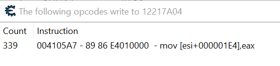
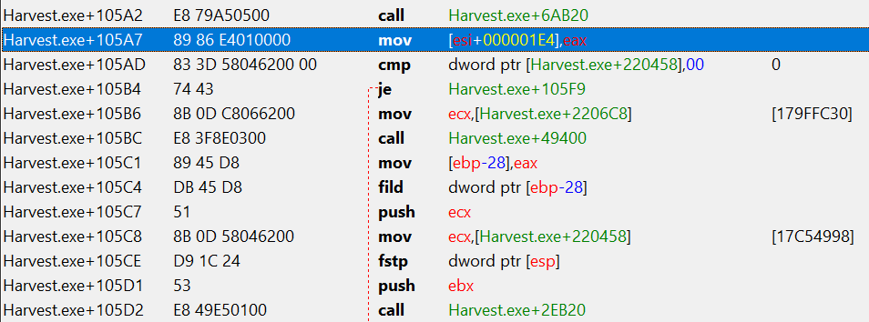
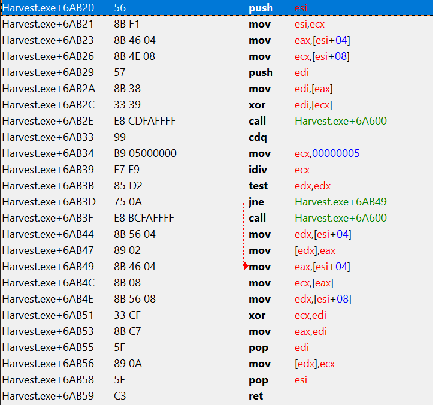

# Harvest: Massive Encounter - Unlimited Money Hack

[Harvest: Massive Encounter](https://store.steampowered.com/app/15400/Harvest_Massive_Encounter/) 
is a simple strategy game where you have to gather minerals which will get turned into money and
defend against enemy alien forces.

The game itself gets repetetive after a few games. 
You can only build static structures and no units, the enemy does not have a base and will just 
send units similar to a tower defense game. 
There are a few different game modes and three different maps, but thats it. 
However I bought it at a Steam sale and for its price it was ok.

One day I decided to practice a bit with [Cheat Engine](https://www.cheatengine.org/) and refresh my 
reversing and assembly knowledge, because solving the last CTF challenge of this category as well as
the exercises I had to do for university were already a long time ago.

Cheat Engine is a very powerful tool for analysing an executable and patching code in memory, 
or simply change some memory values of a process.

## Unlimited Money

In most games it is very easy to find certain values and just change the values in memory in order
to achieve the desired result. At first I thought this was the same here, just find the address at 
which the money is stored and set it to a very high value and we are done.

However, in practice this was not possible.
When the money value is changed it will get immediately overwritten again.
This means the real value is stored somewhere else.
Using the function "Find out what writes to this address" and then showing the code in the disassembler
we can investigate what is going on.



We see that the value at the address is constantly overwritten.
Let's browse the code around this write instruction in the disassembler:



We can see that a function (`Harvest.exe+6AB20`) gets called and afterwards and the result is written
to the address where the money is located.
The function contains the following instructions:



By setting a breakpoint ("break and trace instructions") and analysing the function we can see that, 
after the `xor` at `Harvest.exe+6AB2C`, the value of the money is in the `EDI` register.
So there is some kind of protection like a one time pad which encrypts the value of the money with some
other value in order to protect it from being manipulated.

If we manipulate the value of `EDI` after decryption and before the instruction `call Harvest.exe+6AB2C` 
at `Harvest.exe+6AB2E` we can see that this will also change the money, that is displayed in the game UI.
The value of `EDI` gets encrypted and this value is written back into memory.

However, we cannot modify this function directly, because it is also used
for other values like the *threat level*, which determines the number and strength of enemies that will 
get spawned.

To bypass this we can just replace the specific call of the encryption function for the money value at 
`Harvest.exe+105A2` with a call of a custom function.
In Cheat Engine we can select the address of the call and go to `Tools > Auto assemble > Template > Full Injection`.
Then we copy the code of the original function and insert a simple `mov edi,0000270F` after the `xor` which will set
the amount of money to 9999 (in decimal base). 
Furthermore the jump (`Harvest.exe+6AB3D`) inside the function needs to be adapted to also jump inside our 
function, otherwise we would jump to a wrong address.

The full auto assembler script with the injected code looks like this:

```x86asm
{ Game   : Harvest.exe
  Version: 1.0
  Date   : 2019-08-17
  Author : 7085

  Unlimited/fixed amount of colonial credits.
}

define(address,"Harvest.exe"+105A2)
define(bytes,E8 79 A5 05 00)
define(money,0000270F)

[ENABLE]

assert(address,bytes)
alloc(newmem,$1000)

label(code)
label(code2)
label(return)

newmem:

code:
  //call Harvest.exe+6AB20
  push esi
  mov esi,ecx
  mov eax,[esi+04]
  mov ecx,[esi+08]
  push edi
  mov edi,[eax]
  xor edi,[ecx]
  // change
  mov edi,money
  call Harvest.exe+6A600
  cdq
  mov ecx,00000005
  idiv ecx
  test edx,edx
  jne code2
  call Harvest.exe+6A600
  mov edx,[esi+04]
  mov [edx],eax
code2:
  mov eax,[esi+04]
  mov ecx,[eax]
  mov edx,[esi+08]
  xor ecx,edi
  mov eax,edi
  pop edi
  mov [edx],ecx
  pop esi
  //ret
  jmp return

address:
  jmp newmem
return:

[DISABLE]

address:
  db bytes
  // call Harvest.exe+6AB20

dealloc(newmem)
```

You can download the script [here](https://raw.githubusercontent.com/7085/7085.github.io/master/posts/2019-12-01-harvest-massive-encounter-unlimited-money/Harvest.CT).

After activating it we can see that the money will change to 9999 and wont decrease when we build structures.


Note: This was just done for experimenting with Cheat Engine, so the script could be improved or cleaned up more.

